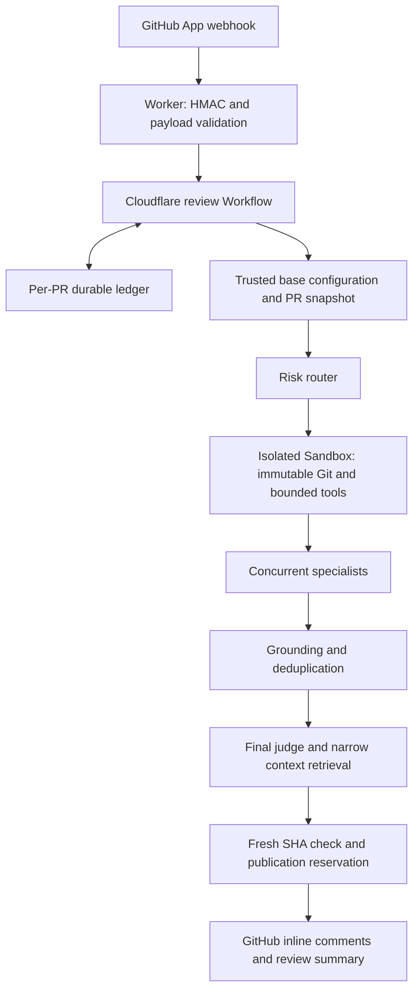

# Sherpa

Sherpa reviews GitHub pull requests using isolated repository tools, specialist AI reviewers, and an independent evidence judge. It is a GitHub App deployed on Cloudflare Workers, Workflows, Durable Objects, and Sandbox. Verified findings determine whether it approves, comments, or requests changes.

The implementation covers V0–V4: authenticated events, repository investigation, multiple reviewers, arbitration, risk routing, incremental reviews, and cost controls. Automated tests exercise the complete path with mocked GitHub/model APIs, plus real local Git and subprocesses. A real private-repository review still requires your GitHub App, provider credentials, and Cloudflare deployment. See [validation evidence](docs/validation.md) for the precise checks and remaining live verification.

## Architecture



`apps/worker` is the deployable service. `packages/github`, `sandbox`, `models`, `agents`, `schemas`, `shared`, and `workflow` own separate responsibilities. The [architecture document](docs/architecture.md) explains trust boundaries and failure handling.

## Prerequisites and local development

- Node.js 22+, pnpm 9.12.1, Git, and Python 3 for the real subprocess tests.
- Docker Desktop or a compatible engine for the container build and local Sandbox.
- A Cloudflare account with Workers Paid, Workflows, Durable Objects, and Containers available.
- A GitHub App and a Cloudflare AI Gateway token with a funded account. Individual model-provider keys are optional.

```sh
pnpm install --frozen-lockfile
cp apps/worker/.dev.vars.example apps/worker/.dev.vars
```

Populate the local file, then configure the model IDs and prices described below. Never commit `.dev.vars`, `.env`, PEM keys, or provider credentials.

```sh
pnpm typegen
pnpm dev
```

`GET /health` returns service liveness. `POST /github/webhook` accepts GitHub deliveries. No public endpoint exposes repository contents, Sandbox commands, or review records. For local webhook delivery, use an HTTPS tunnel to Wrangler's local port and set the App webhook URL to its `/github/webhook` route.

## GitHub App setup

1. In GitHub developer settings, create a **GitHub App**, named Sherpa or your available app name. Set its homepage to your project/site.
2. Enable webhooks. Set the URL to `https://YOUR-WORKER.workers.dev/github/webhook`, and set a strong random webhook secret.
3. Set the **user authorization callback URL** to `https://YOUR-WORKER.workers.dev/setup/callback` and the **setup URL** to `https://YOUR-WORKER.workers.dev/setup`. Enable **Redirect on update**. Leave **Request user authorization (OAuth) during installation** off so the setup URL can start OAuth with CSRF state.
4. Repository permissions: **Metadata read**, **Contents read**, **Pull requests read and write**. No organization permissions, Actions permissions, Checks permissions, or PAT are needed.
5. Subscribe to **Pull request** events. Sherpa handles `opened`, `reopened`, and `synchronize`; other events/actions are ignored after signature verification.
6. Save the App ID and Client ID, generate a client secret, and generate a private key. Both GitHub's downloaded RSA PEM and PKCS#8 PEM are accepted.
7. Install the App on **selected repositories**. After install, GitHub sends the installer to `/setup` to save **their** Cloudflare AI Gateway. Every GitHub token is further restricted to the reviewed repository.

Follow GitHub's [App creation guide](https://docs.github.com/en/apps/creating-github-apps/registering-a-github-app/registering-a-github-app). Keep the webhook secret identical in GitHub and Cloudflare. Installation tokens are minted as needed; private Git credentials are injected by trusted Worker code outside the container during repository preparation.

### End-user billing

People using Sherpa on a repository install the GitHub App, then save a Cloudflare AI Gateway for that **installation** (one Gateway covers every repo on the install):

1. Create a gateway in their Cloudflare account (name such as `sherpa`) and enable Unified Billing with credits.
2. Create an API token with **Account → Workers AI → Read**.
3. Open `https://YOUR-WORKER.workers.dev/setup`, authorize GitHub, and paste account ID, gateway name, and token.

They do not deploy a Worker or put keys in the repo. `.ai-reviewer.yml` cannot supply credentials or provider URLs. Missing billing posts an incomplete `COMMENT` review (not an approval); they save a Gateway and push a new commit. Inference bills **their** Gateway. Cloudflare Worker/Sandbox compute still bills the operator.

## Model providers and prices

Sherpa defaults to **Cloudflare AI Gateway** per GitHub App installation. Each installer pays for reviews of their repos with their own gateway token. You do not put a review inference token on the Worker. API origins are fixed; repository files and models cannot choose a provider URL.

The operator still chooses which catalog model IDs and prices the service will call. Customer gateways must have those models available through Unified Billing.

1. Keep each model's provider as `cloudflare` and supply its qualified catalog ID, such as `openai/<model>`, `anthropic/<model>`, or a supported `@cf/...` Workers AI model. Check the current [model catalog](https://developers.cloudflare.com/ai-gateway/models/) for availability.
2. Tell installers to create a gateway, enable Unified Billing, and save account ID / gateway name / token at `/setup`.

Sherpa uses the current account-scoped inference REST API with the gateway header. It disables gateway content logging, cache and retries on review calls; Sherpa owns retry accounting. Cloudflare credit-purchase fees and infrastructure charges are separate from Sherpa's token estimates. Workers AI models use your Cloudflare account billing; follow the gateway's Workers AI billing settings when choosing prepaid credits. See [Unified Billing](https://developers.cloudflare.com/ai-gateway/features/unified-billing/) and [REST authentication](https://developers.cloudflare.com/ai-gateway/usage/rest-api/).

Set these nonsecret variables in `apps/worker/wrangler.jsonc` (or override them in local `.dev.vars`):

| Variable                                  | Purpose                                                           |
| ----------------------------------------- | ----------------------------------------------------------------- |
| `GITHUB_CLIENT_ID`                        | GitHub App client ID (public)                                     |
| `PUBLIC_BASE_URL`                         | Public `https://` origin used in billing setup links              |
| `ROUTER_PROVIDER`, `ROUTER_MODEL`         | Cheap lightweight review and optional classification              |
| `SPECIALIST_PROVIDER`, `SPECIALIST_MODEL` | Coding specialists                                                |
| `JUDGE_PROVIDER`, `JUDGE_MODEL`           | Final evidence arbitration                                        |
| `MODEL_PRICING_JSON`                      | Per-model token prices for budget reservations                    |
| `ALLOWED_MODELS_JSON`                     | Explicit model choices a repository may override                  |
| `MAX_REVIEW_COST_USD`                     | Service ceiling for each review, default `1.00`                   |
| `MAX_AGENT_CALLS`                         | Physical model-request ceiling, including retries, default `18`   |
| `MAX_REVIEW_DURATION_MS`                  | Analysis deadline, default `600000`                               |
| `ALLOW_REPOSITORY_VALIDATION`             | Service permission for opt-in repository scripts, default `false` |

Reviews use the installation's Gateway token only. Operator `CLOUDFLARE_AI_GATEWAY_TOKEN` / native provider keys are not used for GitHub-triggered reviews.

`MODEL_PRICING_JSON` is an object keyed by `provider/model-id`. Each price has `inputUsdPerMillion` and `outputUsdPerMillion`; optionally set `cachedInputUsdPerMillion` and, for Anthropic prompt-cache writes, `cacheWriteInputUsdPerMillion`. Enter current prices for your account; the service intentionally contains no default model IDs or hardcoded price schedule. Unknown prices prevent model calls instead of silently treating them as free. Estimates cover model tokens, not Cloudflare compute, storage, or external billing adjustments.

Example shape (the rates below are **illustrative**, not a provider price quote):

```json
{
  "cloudflare/openai/your-model-id": {
    "inputUsdPerMillion": 1,
    "outputUsdPerMillion": 5,
    "cachedInputUsdPerMillion": 0.1
  }
}
```

`ALLOWED_MODELS_JSON` has this shape: `[{"provider":"cloudflare","model":"openai/your-model-id"}]`. Repository overrides outside this list are ignored. Service model choices themselves must have configured credentials and pricing. JSON model responses and token usage are validated; provider failures never expose response bodies in logs.

## Cloudflare deployment

The Wrangler config declares the Workflow, SQLite Durable Object classes, migrations, observability, and the Sandbox container. Keep the exact Sandbox SDK version and Docker image tag aligned. The container has no baked credentials.

```sh
pnpm exec wrangler login
pnpm check
pnpm deploy
```

Set the GitHub secrets using the interactive prompts:

```sh
pnpm exec wrangler secret put GITHUB_APP_ID --config apps/worker/wrangler.jsonc
pnpm exec wrangler secret put GITHUB_WEBHOOK_SECRET --config apps/worker/wrangler.jsonc
pnpm exec wrangler secret put GITHUB_PRIVATE_KEY --config apps/worker/wrangler.jsonc < /path/to/app-private-key.pem
pnpm exec wrangler secret put GITHUB_CLIENT_SECRET --config apps/worker/wrangler.jsonc
pnpm exec wrangler secret put SETUP_SESSION_SECRET --config apps/worker/wrangler.jsonc
```

Set `GITHUB_CLIENT_ID`, `PUBLIC_BASE_URL`, and production model IDs/prices before enabling the App webhook. Wait for container provisioning after the first deploy. Set the GitHub App webhook URL, callback URL, and setup URL to the deployed Worker. For separate staging/production installations, use separate Worker/Workflow names, namespaces, secrets and App installations; bindings and vars do not automatically inherit into named Wrangler environments.

## Repository policy

No config file is required. To customize a repository, copy [.ai-reviewer.example.yml](.ai-reviewer.example.yml) to **`.ai-reviewer.yml`** and merge it into the base branch. Policy is read at the PR's base SHA; a PR cannot enable its own scripts, increase budgets, or disable its own review by modifying its HEAD config.

Every completed review begins with **🤖 AI Review**, one verdict, compact finding counts, and findings grouped by priority:

| Verdict                       | When                                              | GitHub event      |
| ----------------------------- | ------------------------------------------------- | ----------------- |
| ✅ **Approved**               | No meaningful accepted findings                   | `APPROVE`         |
| 🟡 **Approved With Comments** | Only non-blocking improvements, warnings, or nits | `COMMENT`         |
| ❌ **Not Approved**           | At least one **Must Fix**                         | `REQUEST_CHANGES` |

Findings appear in this order: 🔴 **Must Fix**, 🟠 **Should Fix**, 🟡 **Warnings**, 🔵 **Nits**. Within each group, higher-impact findings appear first. Every Must Fix and Should Fix identifies the location, trigger, consequence, and a verified action. Inline findings also appear in the compact summary. A clean approval does not invent comments.

Specialists investigate narrow hypotheses through ANALYZE → VERIFY → DECIDE, including an explicit attempt to disprove each one using repository tools. Discovery assigns no priority or severity. The independent judge treats every candidate as unverified, gathers its own evidence, and classifies only issues that survive verification. Only Must Fix blocks merging; severity alone never requests changes. The old `blockOnHighSeverity` option is accepted for configuration compatibility but no longer controls publication.

`review.findingLimits` defaults to `shouldFix: 5`, `warnings: 3`, and `nits: 3`; each can be set to 0–30. Accepted Must Fix findings have no presentation cap. `review.maxComments` limits inline comments (default 10); additional displayed findings remain in the summary. Counts include all accepted findings, and the summary explicitly notes any lower-priority feedback omitted by display limits. Duplicate root causes are consolidated before publication.

`review.minimumConfidence` applies to the judge's independently verified decision. `review.minimumSeverity` defaults to `info` and filters non-blocking findings after judgment. It cannot hide a judge-confirmed Must Fix. Zero findings is a good result when no concrete problem survives verification; style preferences, vague advice, unrelated old defects and missing-test filler are rejected. Reaching context, cost, call, or time limits is disclosed as incomplete coverage.

An incomplete or failed review never issues approval. If there are no confirmed blockers, it posts **Review Incomplete** using `COMMENT`; confirmed Must Fix findings still request changes and disclose incomplete coverage. Operational review notes are separate from judge-accepted Warning findings and their counts. Sherpa does not create GitHub Checks or change branch protection.

Path rules add specialists and inject only relevant domain/path guidance from the immutable base commit. See [trusted review policy](docs/review-policy.md) for `reviewRules` and explicit `AGENTS.md` enrollment. Plain documentation changes skip by default; reviewer/security policy changes remain reviewable, dependency changes include security, and authentication, billing, data, and concurrency changes raise risk. Model-assisted routing may add reviewers but cannot remove deterministic assignments. Per-repository limits can only reduce the service's cost/call/time ceilings.

Validation requires **both** `ALLOW_REPOSITORY_VALIDATION=true` and trusted-base `validation.enabled: true`. Dependency installation additionally requires `validation.installDependencies: true`. A single root lockfile chooses pnpm, npm, or Yarn. Lifecycle scripts are disabled during installation. Project tests, type checks and lint run in a nested process/network sandbox with time/output limits; unavailable tools and unsupported isolation are reported as skipped or failed, never as successful checks. See [Sandbox limits](packages/sandbox/README.md).

## First real review

1. Finish deployment, secrets, models/prices, webhook/setup URLs, and App installation.
2. Complete `/setup` with a Cloudflare AI Gateway for that installation.
3. Open a small **nondraft code PR** in an installed test repository. Documentation-only PRs normally skip. Include a demonstrable regression and its surrounding context.
4. In the App's recent deliveries, confirm a `202` response containing `reviewId`.
5. Follow `pnpm exec wrangler tail --config apps/worker/wrangler.jsonc`; filter on that review ID. Inspect the `sherpa-review` Workflow instance in the Cloudflare dashboard.
6. Confirm a Sherpa review appears at the current commit, with any accepted comment on a changed line. Redeliver the event and confirm there is still one review.
7. Fix the regression and push. Confirm an incremental review uses the previous successfully reviewed SHA and does not repost the fixed finding. Repeat with a private repository to verify installation authentication and outbound Git interception.

## Testing and troubleshooting

```sh
pnpm test          # Unit, adversarial, real Git tools, mocked full round trip
pnpm eval          # Prompt protocol, ground-truth fixtures and quality metrics
pnpm lint
pnpm typecheck
pnpm format:check
pnpm build         # Wrangler dry run, including the container build; no deploy
```

CI runs these checks. Tests do not require live GitHub or paid model calls.

| Symptom                               | What to check                                                                                                                            |
| ------------------------------------- | ---------------------------------------------------------------------------------------------------------------------------------------- |
| Webhook `401`                         | Secret mismatch or modified raw payload/signature                                                                                        |
| Webhook `400`                         | GitHub event shape, installation/repository identifiers, SHA/delivery headers                                                            |
| Webhook `503`                         | Missing secret or failure to create/confirm the Workflow; redeliver after fixing                                                         |
| No review on docs/draft PR            | Default skip policy or `reviewDrafts: false`                                                                                             |
| `REVIEW_FAILED` / incomplete coverage | Missing installation Gateway at `/setup`, model pricing, provider timeout, truncated diff, failed context/tool call, or exhausted budget |
| Billing setup `403` / spoofed install | User must be able to see that GitHub installation; `installation_id` query params are not trusted                                        |
| Private clone unavailable             | App installation access, Contents permission, container provisioning, outbound policy support                                            |
| Validation unavailable                | Lockfile ambiguity, absent scripts/dependencies, unsupported Yarn version, or nested namespace restrictions                              |
| Old Workflow discarded                | PR base/head changed while the review was running                                                                                        |
| Uncertain publication                 | Inspect the own-bot review marker; recovery performs only reads and never blindly retries POST                                           |

Only completed review coverage advances the incremental SHA. Force pushes, unavailable ancestry, and changed base commits fall back to a full PR comparison. Large or binary diffs are bounded and identified as incomplete. Review status is advisory: a model review cannot prove the absence of defects.

## License

Sherpa is open source under the [MIT License](LICENSE).
