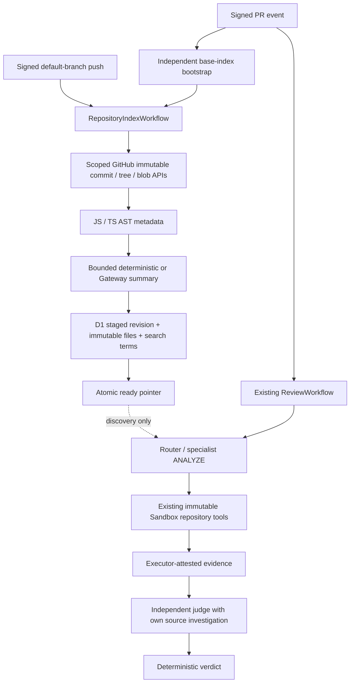

# Persistent repository intelligence

The repository index is contextual retrieval data and is not admissible evidence for review findings.

Sherpa uses this index to decide where to investigate. It never uses index records to establish a Must Fix, Should Fix, Warning, Nit, or merge verdict. Every accepted finding still requires immutable repository reads, executor-owned evidence, and independent judgment.

## Architecture and storage



`packages/repository-index` contains parsing, summary generation, indexing, persistence, and retrieval. `packages/github` extends its existing bounded API and scoped-token abstractions to read Git objects. Indexing runs in its own Workflow; it does not run repository code, use a review Sandbox, or change Sandbox network policy. The PR ledger and installation settings Durable Objects retain their existing responsibilities.

D1 stores private metadata and search postings. No raw source, model transcript, embedding, or credential is stored in index tables. File records include path, blob SHA, byte size, language, parser completeness, bounded symbols/ranges, imports/exports, summary and concepts. A symbol record is a semantic chunk locator rather than a copied source block. Directory structure is derived from file paths. Classes, methods, functions, interfaces, types, enums, namespaces and named constants are supported for JS/TS, including JSX/TSX and CommonJS/ES module extensions. Import relationships are discovery signals, not a resolved call graph.

Tables:

| Table                | Responsibility                                                                            |
| -------------------- | ----------------------------------------------------------------------------------------- |
| `index_repositories` | Active revision pointer and expiring build lease                                          |
| `index_revisions`    | Immutable commit identity, representation version, status, timestamps, indexed file count |
| `index_files`        | Content-addressed metadata keyed by scope, path, blob, size and representation version    |
| `index_members`      | Complete revision membership, referencing reusable file records                           |
| `index_terms`        | Weighted lexical, path, symbol, import and summary postings                               |

All keys, foreign keys and lookup joins include both installation ID and repository ID. D1 primary sessions provide consistent state across indexing operations. A full repository index never sits in one Durable Object. R2 would be useful for larger archival artifacts, but v1 stores bounded metadata rather than source snapshots. D1 supplies structured search and transactional publication without introducing an external database.

Vectorize was evaluated but is not used in v1. Sherpa currently has a budgeted chat/completions Gateway adapter, not an installation-owned embedding adapter. Adding embeddings requires a separately versioned model, Gateway transport, usage accounting, scoped vector namespace and generation/cleanup lifecycle. V1 supplies lightweight semantic retrieval through summary concepts plus deterministic signals. `semanticEmbeddings: true` is rejected explicitly rather than silently pretending vectors are active.

## Lifecycle and incremental updates

A signed default-branch `push` starts an indexing Workflow for its immutable `after` SHA. Branch deletion and other branches are ignored. A PR event independently bootstraps its base SHA if no usable repository index exists. The review starts regardless of bootstrap success. A schema/config mismatch bootstrap rebuilds the existing indexed SHA, preserving revision identity rather than replacing it with an older PR base. Compatible indexes are not rebuilt by every PR.

1. Validate installation/repository/job identity and obtain a read-only GitHub token scoped to that repository.
2. Acquire an expiring repository build lease with a unique attempt token. A competing Workflow waits, bounded to fifteen minutes. Recheck bootstrap state under the lease.
3. Resolve the exact Git commit to a tree and enumerate its complete immutable tree. Truncated/oversized responses fail the build; no partial tree is advertised as ready.
4. Apply path/size/language exclusions and immutable root/nested `.gitignore` patterns. Nested negations respect Git's rule that an excluded parent directory cannot be re-included by its children.
5. Compare target path/blob identities against content-addressed cached records. Reuse unchanged metadata, summaries and postings. Only added/modified paths require source parsing and optional model calls. Renames are deletion plus addition. Deleted, newly ignored, or unsupported paths are absent from the new membership.
6. Parse changed files, generate bounded summaries, and persist metadata/postings/membership in transactional batches. No source code executes.
7. For pushes, check that the target remains the default-branch SHA. Publish only if the lease and previous active pointer still match and membership count equals the completed build count. The ready transition and pointer update share one D1 transaction.
8. Retain the old ready revision during builds/failures. Prune old nonactive revisions after seven days in bounded batches, then delete unreferenced metadata and postings. Cleanup is opportunistic on successful builds; a quiet repository retains its last state.

Enumerating the tree and assembling membership are O(repository files). This is deliberately different from reparsing/summarizing the full repository: unchanged file metadata and paid summaries are reused. Failed builds retain safely completed immutable records for the next attempt. A repeated ready SHA is a no-op. Generated content detected only after reading its header can be reread on subsequent pushes; it never enters the searchable index.

The Workflow disables automatic retries of paid build steps. A later distinct webhook delivery may start another bounded attempt using persisted progress; identical deliveries deduplicate. A process interruption leaves a building revision behind an expiring lease and cannot publish it. Infrastructure and provider failures return sanitized failure status. The next event can retry after lease expiry.

GitHub branch state and D1 cannot be checked atomically across services. A branch may move immediately after the final GitHub check; the next push build converges to the new SHA. Retrieval always reports the actual indexed SHA, never an assumed branch revision. Force pushes work by comparing immutable target trees rather than assuming ancestry.

## Revision rules and retrieval

Representation identity contains `INDEX_SCHEMA_VERSION`, `SUMMARY_PROMPT_VERSION`, `EMBEDDING_MODEL_VERSION` (`none`), and a hash of model, summary enablement, file-size and exclusion settings. A material version change prevents incompatible cache/retrieval reuse. Operator schema migrations and representation constants must evolve together.

| State                                 | Review behavior                                                           |
| ------------------------------------- | ------------------------------------------------------------------------- |
| Ready exact HEAD                      | `exact`; return locators for that HEAD                                    |
| Ready PR base                         | `base`; exclude all PR changed paths and rename origins                   |
| Other ready compatible revision       | `stale`; report indexed SHA, do not claim ancestry, exclude changed paths |
| Missing                               | Empty `missing` result; ordinary investigation continues                  |
| First build running                   | Empty `building` result; ordinary investigation continues                 |
| Failed build                          | Prior ready revision remains usable; otherwise empty `failed` result      |
| Wrong representation version          | Empty `version-mismatch` result; next push/bootstrap rebuilds             |
| Invalid configuration/storage failure | Empty/unavailable hints; ordinary investigation continues                 |

The retriever prefers exact HEAD, then exact base, then the compatible active index. Queries return ranked paths, small summaries, selected symbol ranges, commit identity, scope and understandable scoring signals. SQL uses bounded indexed term postings to retrieve at most 120 candidates; ranking and result count are bounded locally.

Exact symbols score 100; exact paths 90. Matching symbol/path terms score 15/12, summary concepts 4, import terms 6, imports of changed module names 18, changed paths 6, shared directory 3 and related tests 2. Proximity boosts apply to related candidates. Camel-case splitting and simple plural normalization support identifier/concept queries. This is approximate lexical/relationship retrieval, not language-server caller resolution or vector similarity. Matching symbols are selected ahead of other symbol records.

Reviews invoke retrieval once with changed-file paths, sharing at most 3 KiB of validated hints with routing and specialist ANALYZE. A 1.5-second deadline protects review latency. Truncated PR file lists disable hints because changed-path exclusion cannot be established safely. Hints are not duplicated into specialist VERIFY or judge payloads. The callback interface supports future more targeted discovery requests without giving models a new evidence-producing tool.

## Model usage, trust and privacy

`INDEX_MODEL` is independent of router/specialist/judge models. Its qualified model ID chooses the upstream provider through the installation-owned Cloudflare AI Gateway. Worker/operator credentials are never a fallback. Existing `ReviewBudget` reservations cap physical requests, tokens, deadlines and estimated USD. Prices come from the existing service pricing table; unknown prices fail summary inference and preserve deterministic indexing. No automatic model retries or output repairs occur for summaries.

Every eligible file receives a short deterministic summary. At most the configured number of changed files receive model summaries per build. The model sees only bounded parser metadata (names, kinds, imports/exports and path), never code bodies, literal values or comments. Recognizable credential patterns suppress inference. Outputs contain only validated summary/concepts; models cannot choose identity, paths, locations or IDs. The first unavailable/invalid summary falls back to deterministic output and prevents further attempts (already in-flight bounded calls may complete). Files cached with deterministic summaries remain deterministic until changed or representation version changes.

Metadata-only summaries infer likely responsibility and concepts; they cannot establish implementation side effects. Source identifiers and filenames themselves remain proprietary untrusted data. Gateway payload logging, caching and retries remain disabled by the existing provider transport. Keep D1 access limited to authorized service operators and include it in installation data-retention/deletion procedures. There is no public or cross-repository index query endpoint.

Source paths, comments, identifiers and summaries cannot become system policy. Hints live in an explicitly untrusted user-message envelope. Base-enrolled review policy retains its existing separate trust boundary. Routing can add investigation assignments but cannot remove deterministic specialists. Neither index IDs nor summaries can enter `RepositoryTools`, executor `EvidenceStore`, or admissible citation sets. The judge investigates candidates using its own HEAD/baseline/disproof tools.

Index logs whitelist operational counters, fixed status/code values and scope IDs. They omit paths, source, queries, summaries, provider errors, credentials and model responses. Metrics include initial/incremental duration, parsed/reused/skipped files, summaries and attempts, zero embedding operations, token usage, estimated USD and accounting uncertainty, retrieval latency/count/status, stale use and failures. Infrastructure cost is separate. Review diagnostics also disclose index retrieval failures without changing coverage solely because indexing is unavailable.

## Configuration and deployment

Wrangler declares `INDEX_DB` (`sherpa-repository-index`) and `INDEX_WORKFLOW`. Apply `apps/worker/migrations/0001_repository_index.sql` before enabling indexing in a deployed environment. The binding supports Wrangler automatic provisioning; record its actual database ID when provisioning manually. Enable the **Push** webhook subscription in the GitHub App; existing Contents read access is sufficient. The existing installation setup supplies Gateway credentials.

| Setting              | Default               | Purpose                                                                 |
| -------------------- | --------------------- | ----------------------------------------------------------------------- |
| `INDEX_ENABLED`      | `true`                | Service switch; disabled uses ordinary review                           |
| `INDEX_MODEL`        | `openai/gpt-4.1-mini` | Qualified upstream model through Cloudflare Gateway                     |
| `INDEX_CONFIG_JSON`  | `{}`                  | Optional bounded settings below                                         |
| `maxFileBytes`       | 131072                | Source size cap, at most 256 KiB                                        |
| `maxFiles`           | 20000                 | Regular-file cap; source tree also caps total entries at 20000          |
| `excludePaths`       | `[]`                  | Additional exact paths, directory prefixes or `*`, `**`, `?` patterns   |
| `summaryLimit`       | 20                    | Maximum inference attempts per build; zero uses deterministic summaries |
| `maxUsd`             | 0.25                  | Independent model spend cap per build                                   |
| `retrievalLimit`     | 6                     | Ranked result cap, at most 10                                           |
| `concurrency`        | 4                     | Concurrent changed-file operations, at most 8                           |
| `maxDurationMs`      | 600000                | Build deadline, at most 840000                                          |
| `semanticEmbeddings` | `false`               | Only supported value in v1                                              |

Language support is fixed to JS/TS in v1; add parser adapters and bump the representation version for additional languages. Defaults exclude dependency/generated/build directories, minified/generated filenames, sensitive paths, lockfiles, binary content and oversized files. Git links/symlinks are never followed. Ignore file count/size and provider/API response sizes are also bounded. Oversized repositories fail safely instead of silently presenting partial knowledge.

Local migration validation:

```sh
pnpm exec wrangler d1 migrations apply sherpa-repository-index --local --config apps/worker/wrangler.jsonc
pnpm typegen
pnpm test
pnpm lint
pnpm typecheck
pnpm build
pnpm test:index-runtime
```

For production, create/provision D1, apply the same migration with `--remote`, deploy the Worker, and enable Push delivery. A default-branch push or subsequent PR event initializes the index. Deployment and paid/live acceptance are separate from local implementation validation.

## Validation and limits

Tests use the actual migration and SQLite engine for staging, publication, caching, ranking, pruning and isolation. The optional `pnpm test:index-runtime` bundles the index with Wrangler’s installed toolchain and actual compatibility/define settings, then runs parsing, D1 publication and retrieval inside local workerd. The TypeScript compiler bootstrap needs virtual `__filename`/`__dirname` defines when its CommonJS module is bundled as Worker ESM; AST parsing never uses those paths to read repository files. Additional mocked GitHub/Workflow/provider tests cover bounded immutable source reads, malformed/truncated responses, missing Gateway, workflow failure, prompt injection, spend boundaries and dispatch isolation. Existing specialist/judge protocol tests explicitly reject index-only citations and retain immutable source reads.

V1 intentionally omits cross-repository graphs, embeddings, resolved call graphs and additional languages. Large first builds may hit GitHub rate limits or the build deadline; subsequent events reuse persisted progress. Opportunistic cleanup is not a hard wall-clock deletion guarantee. A deployed private-repository push/PR smoke test is still needed to measure actual Gateway summary quality, D1 latency and API/runtime limits at production scale.
